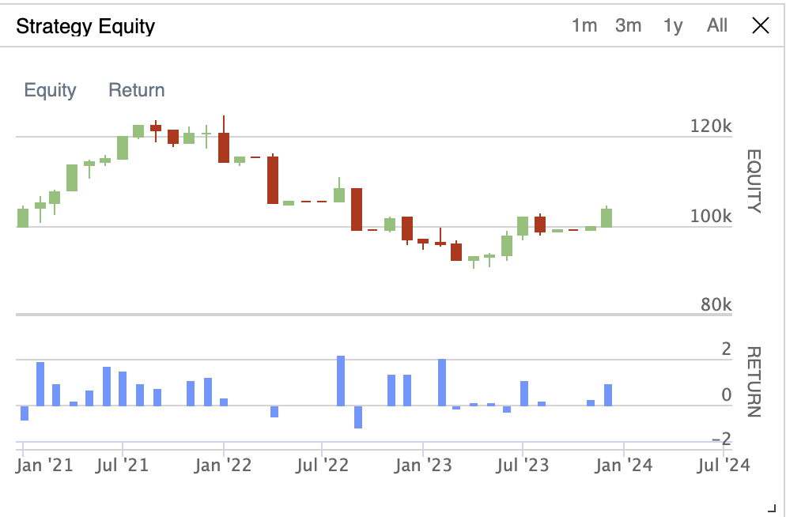

# SPY Moving Average Crossover Strategy & Parameter Optimization

## Overview
A quantitative trading strategy built on QuantConnect that implements a 
moving average crossover system on SPY (S&P 500 ETF), backtested across 
a 3-year period covering the 2021 bull market, 2022 bear market, and 2023 
recovery. The project focuses on strategy implementation, performance 
analysis, and systematic parameter optimization to maximize risk-adjusted 
returns.

## Strategy Logic
The algorithm uses two moving averages calculated daily:
- **Short MA (20 days):** Reacts quickly to recent price momentum
- **Long MA (50 days):** Represents the longer-term trend

**Buy signal:** When the 20-day MA crosses above the 50-day MA — trend turning upward, enter 100% long SPY  
**Sell signal:** When the 20-day MA crosses below the 50-day MA — trend weakening, exit to cash

## Backtest Results (January 2021 – January 2024)
| Metric | Value |
|---|---|
| Starting Capital | $100,000 |
| Final Portfolio Value | $104,527.59 |
| Total Return | 4.53% |
| Transaction Fees | $19.52 |
| Total Volume Traded | $1,542,150.76 |
| PSR (Probabilistic Sharpe Ratio) | 3.949% |

## Strategy Equity Chart

## Key Findings
- Strategy provided meaningful downside protection during the 2022 bear 
  market by exiting to cash when momentum turned negative, avoiding full 
  drawdown exposure
- Underperformed buy-and-hold during the 2021 bull run due to the inherent 
  lag in moving average signals — a known tradeoff of trend-following strategies
- Parameter optimization across 80+ short/long window combinations identified 
  the configuration with the highest risk-adjusted return measured by Sharpe ratio

## What I Learned
Moving average crossover strategies involve a fundamental tradeoff — they 
protect capital in volatile/bear markets but lag in strong bull markets. 
The optimization process revealed that no single parameter set dominates 
across all market regimes, which motivates more advanced adaptive strategies 
as a next step.

## Tech Stack
- Python
- QuantConnect LEAN Engine
- Pandas, NumPy
- SPY daily OHLCV data (2021–2024)

## How to Run
1. Create a free account at quantconnect.com
2. Create a new project and paste main.py into the editor
3. Hit Build + Run to execute the backtest
4. Results appear in the Strategy Equity chart and Debug logs

## Next Steps
- Implement adaptive parameter selection that adjusts windows based on 
  market volatility regime
- Extend to multi-asset portfolio with correlation-based position sizing
- Apply same framework to clinical time-series data (patient outcomes, 
  treatment response intervals)

  
